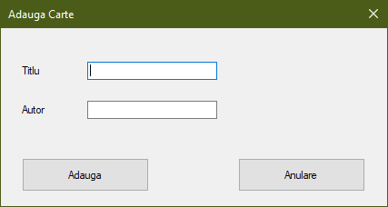
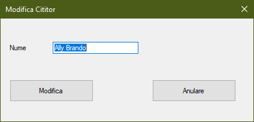
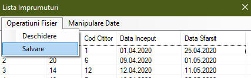

# Imprumuturi Biblioteca
 
Aplicatie pentru gestionarea imprumuturilor de carti realizate in cadrul unei biblioteci studentesti. Aplicatia este pentru sistemul de operare Windows, scrisa in limbajul C#.

## Lista carti

Lista de carti este gestionata de bibliotecar si va contine un cod intern generat automat pentru fiecare carte, titlul acesteia si numele autorului.

Pentru a adauga o carte noua in lista, bibliotecarul va accesa optiunea de *Adaugare* din meniul *Manipulare Date* si apoi va introduce titlul acesteia si autorul.

Daca se doreste printarea listei de carti spre a fi afisate toate exemplarele detinute de biblioteca, se va selecta optiunea *Print*.

Pentru a salva lista de carti la finalul sesiunii de lucru se va utiliza optiunea *Salvare* din meniul *Operatiuni Fisier*.

Fisierul va fi salvat cu extensia *.txt* si este de tip csv.
 
## Lista cititori

Un student care doreste sa imprumute pentru prima data o carte va trebui sa se inscrie in lista de cititori, iar pe baza numelui va primi un cod, cu ajutorul caruia va efectua operatiunile de imprumutare.

Pentru a adauga un cititor nou in lista, bibliotecarul va accesa optiunea de *Adaugare* din meniul *Manipulare Date* si apoi va introduce numele acestuia.

In cazul in care numele persoanei a fost introdus eronat, acesta poate fi modificat selectand din lista cititorul in cauza, apoi se va utiliza optiunea *Modificare* din meniul *Manipulare Date*

Pentru a salva lista cititorilor la finalul sesiunii de lucru se va utiliza optiunea *Salvare* din meniul *Operatiuni Fisier*.

Fisierul va fi salvat cu extensia *.txt* si este de tip csv.

## Lista imprumuturi

Operatiunea de imprumutare va avea un cod acordat automat de aplicatie, bibliotecarul trebuind sa introduca numai codul cartii si al cititorului si datele de inceput si de sfarsit ale imprumutului.

Pentru adaugarea unui nou imprumut, bibliotecarul va utiliza optiunea de *Adaugare* din cadrul meniului *Manipulare Date*.

Daca s-au introdus date eronate cu privire la un imprumut, acestea pot fi corectate cu ajutorul optiunii *Modificare* din meniul *Manipulare Date*

Pentru a salva lista imprumuturilor la finalul sesiunii de lucru se va utiliza optiunea *Salvare* din meniul *Operatiuni Fisier*.

Fisierul va fi salvat cu extensia *.txt* si este de tip csv.